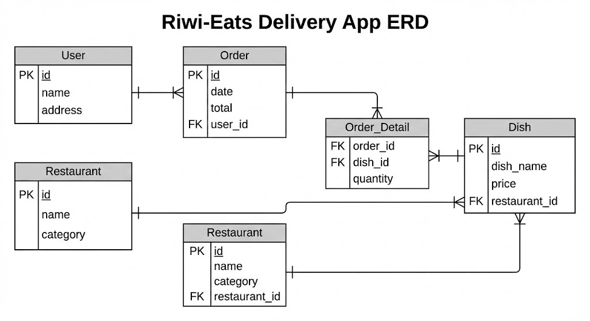

# 🎨 Semana 1 - Anexo: Taller de Diagramas Entidad-Relación (MER)
**Clan:** Hamilton  
**Tema:** Diseño Lógico, Modelado Visual y Cardinalidad  
**Duración:** 1.5 - 2 Horas (Práctica)

---

## 🎯 Objetivo del Taller
Aprender a ser "Arquitectos de Datos". Antes de escribir código SQL, debemos crear los planos.
En este taller aprenderemos a:
1.  Identificar Entidades y Relaciones en un problema real.
2.  Usar la notación **"Pata de Gallo" (Crow's Foot)**.
3.  Resolver el problema de las relaciones "Muchos a Muchos".

---

## 1. ¿Qué es un MER?
Es un dibujo estándar que muestra **QUÉ** información guardamos y **CÓMO** se relaciona.
* **Herramientas recomendadas:** Pizarra (para explicar), Lápiz y Papel (para empezar), Draw.io (para digitalizar).

### Los 3 Elementos Gráficos (La Sintaxis)

#### A. La Entidad (El Rectángulo)
Representa un objeto del mundo real del cual queremos guardar información.
* **Tip:** Son los **Sustantivos** importantes del requerimiento.
* *Ejemplo:* `Usuario`, `Producto`, `Factura`.

#### B. Los Atributos (Lista dentro del rectángulo)
Son las características o detalles.
* **PK (Primary Key):** El identificador único (Subrayado o con llave 🔑).
* **FK (Foreign Key):** El conector con otra tabla.
* *Ejemplo:* `nombre`, `precio`, `fecha_nacimiento`.

#### C. La Relación (La Línea)
Es la conexión entre dos entidades.
* **Tip:** Son los **Verbos** que unen a los sustantivos.
* *Ejemplo:* Un Cliente **COMPRA** un Producto.

---

## 2. Cardinalidad: ¿Cómo leer las líneas?
La parte más crítica del diseño. Define "cuántos de aquí se relacionan con cuántos de allá". Usaremos la notación estándar de industria: **Crow's Foot**.

### Símbolos en las puntas de la línea:
* **| (Palito):** Representa "UNO".
* **Ψ (Pata de Gallo):** Representa "MUCHOS".
* **O (Círculo):** Representa "CERO" (Opcional).

### Las 3 Relaciones Clave

#### 1. Uno a Muchos (1:N) ⭐ *La Regla de Oro*
Es la más común (90% de los casos).
* **Lectura:** "Un **Clan** tiene **Muchos** Coders, pero un **Coder** pertenece a **Un** solo Clan".
* **Dibujo:**
    * Lado Clan (Padre): `|`
    * Lado Coder (Hijo): `Ψ` (Pata de Gallo)
* **📌 REGLA DE ORO:** La Pata de Gallo (`Ψ`) **SIEMPRE** lleva la Llave Foránea (`FK`).
    * *Por qué:* Porque es el "Hijo" quien necesita saber quién es su "Padre".

#### 2. Muchos a Muchos (N:M) ⚠️ *El Problema*
* **Lectura:** "Un **Estudiante** ve **Muchas** Materias y una **Materia** tiene **Muchos** Estudiantes".
* **Dibujo:** Pata de Gallo en ambos lados (`Ψ --- Ψ`).
* **📌 SOLUCIÓN:** En bases de datos relacionales, esto **NO SE PUEDE** implementar directamente.
    * Se debe crear una **Tabla Intermedia** (o Pivote) en el centro.
    * La relación N:M se rompe en dos relaciones 1:N que apuntan hacia el centro.

#### 3. Uno a Uno (1:1) ⚪ *Poco común*
* **Lectura:** "Un **Ciudadano** tiene **Un** Pasaporte".
* **Dibujo:** Línea simple en ambos lados (`| --- |`).

---

## 3. Taller Guiado Paso a Paso: "Riwi-Eats"
*(Instructor: Dibuja esto en la pizarra interactuando con ellos)*

**Contexto:** "Queremos una app donde los **Usuarios** pidan comida a **Restaurantes**. Los restaurantes tienen **Platos**. Un pedido puede tener varios platos".

### Paso 1: Lluvia de Sustantivos (Entidades)
Pregunta a la clase: *¿Qué objetos detectan?*
* `Usuario`
* `Restaurante`
* `Plato`
* `Pedido`

### Paso 2: Definir Atributos Básicos
* `Usuario`: id (PK), nombre, direccion.
* `Restaurante`: id (PK), nombre, categoria.
* `Plato`: id (PK), nombre_plato, precio.
* `Pedido`: id (PK), fecha, total.

### Paso 3: Definir Relaciones (Interrogatorio)
Aquí es donde aprenden a pensar. Haz estas preguntas:

1.  **¿Un Restaurante tiene muchos Platos?** -> SÍ.
    * **¿Un Plato es de muchos Restaurantes?** -> NO (Es exclusivo de ese local).
    * **Resultado:** Relación **1:N**. (Pata de gallo en Plato).
    * **Acción:** `Plato` recibe `id_restaurante` (FK).

2.  **¿Un Usuario hace muchos Pedidos?** -> SÍ.
    * **¿Un Pedido es de muchos Usuarios?** -> NO (Es de uno solo).
    * **Resultado:** Relación **1:N**. (Pata de gallo en Pedido).
    * **Acción:** `Pedido` recibe `id_usuario` (FK).

3.  **¿Un Pedido tiene muchos Platos?** -> SÍ (Pedí hamburguesa y papas).
    * **¿Un Plato (ej. "Hamburguesa Riwi") aparece en muchos Pedidos?** -> SÍ (Mucha gente lo pide).
    * **Resultado:** Relación **N:M (Muchos a Muchos)**.
    * **Acción:** ¡ALERTA! Necesitamos tabla intermedia `Detalle_Pedido`.

### Paso 4: El Dibujo Final (Solución Visual)



```text
[ Usuario ] ---||---------------|< [ Pedido ]
(PK: id)                          (PK: id)
(nombre)                          (FK: id_usuario) 
                                      |
                                      | 1
                                      |
                                     /|\ N
                            [ Detalle_Pedido ] (Tabla Intermedia)
                            (FK: id_pedido)  <-- Viene de Pedido
                            (FK: id_plato)   <-- Viene de Plato
                            (cantidad)       <-- Dato propio (¿Cuántas hamburguesas?)
                                     \|/ N
                                      |
                                      | 1
                                      |
[ Restaurante ] -||-------------|< [ Plato ]
(PK: id)                           (PK: id)
(nombre)                           (FK: id_restaurante)
```
## 🚀 3. RETO PRÁCTICO 1: "La Veterinaria" (En Parejas)
**Tiempo:** 20 Minutos.  
**Herramienta:** Lápiz y Papel o Draw.io.

**Instrucciones:**
Diseñen el MER para una clínica veterinaria que necesita guardar lo siguiente:

1.  **Dueños:** Tienen DNI (PK), nombre, apellido, teléfono.
2.  **Mascotas:** Tienen Codigo_Chip (PK), nombre, especie (perro/gato), raza, fecha_nacimiento.
    * *Regla:* Un dueño tiene muchas mascotas.
3.  **Médicos:** Tienen Licencia (PK), nombre, especialidad.
4.  **Citas:** Tienen Fecha, Hora y Motivo.
    * *Regla:* En una cita participa **una** mascota y **un** médico.
    * *Regla:* Una mascota tiene muchas citas en su vida. Un médico atiende muchas citas.

**Entregable:**
Un diagrama donde se vea claramente:
* Las 4 entidades (Rectángulos).
* Las líneas de relación con la "Pata de Gallo" en el lugar correcto.
* **Pregunta clave:** ¿Qué tabla lleva la FK en la relación Médico-Cita?

---

## 🏆 4. RETO PRÁCTICO 2: "El Sistema Riwi" (Individual)
**Tiempo:** 30 Minutos.  
**Objetivo:** Modelar su propia realidad.

**Instrucciones:**
Diseña la base de datos para gestionar la academia.

**Requerimientos:**

1.  Existen **Clanes** (Ej: Hamilton, Lovelace). Tienen nombre y salón.
2.  Existen **Coders**. Tienen nombre y edad.
    * Un Clan tiene muchos Coders.
3.  Existen **Habilidades** (Ej: Python, SQL, Java, Inglés).
    * Un Coder puede tener muchas habilidades.
    * Una habilidad la tienen muchos Coders.
    * > *(Pista: Esto huele a N:M... necesitas una tabla intermedia).*
4.  Cada Coder tiene **una** sola **Laptop** asignada por la academia (Serial, Marca).
    * Relación 1:1 (Un coder tiene una laptop, una laptop pertenece a un coder).

**Entregable:**
* Diagrama completo marcando PK y FK.