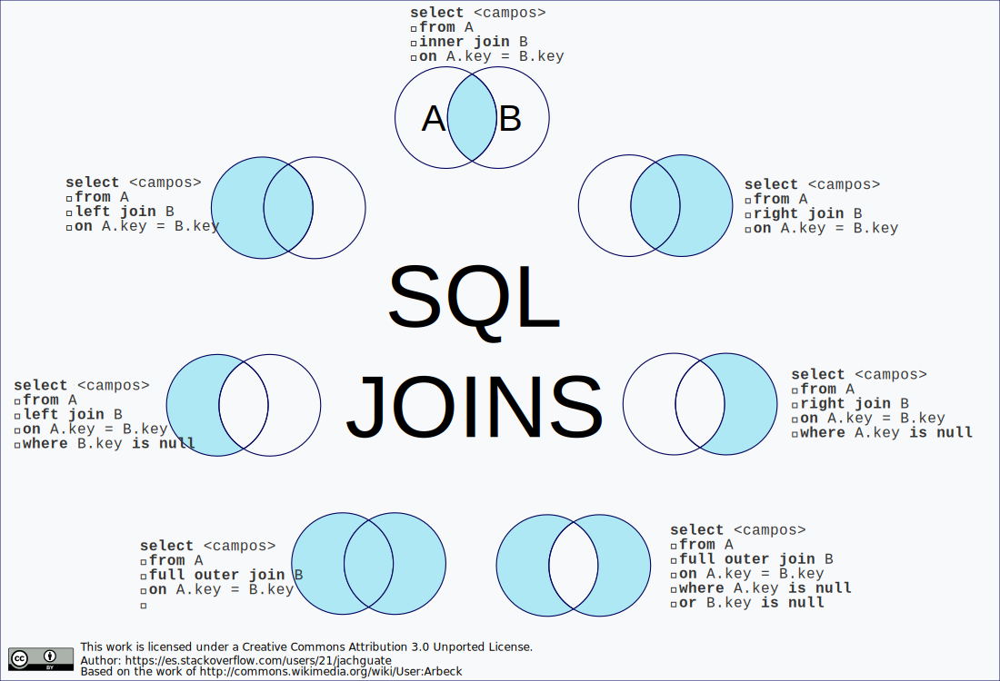

# 🔗 Semana 2 - Entrenamiento 1: El Poder de los JOINs
**Clan:** Hamilton  
**Tema:** Consultas Relacionales (SQL Joins)  
**Duración:** 2 - 2.5 Horas

---

## 🎯 Objetivo de la Sesión
Dejar de pensar en tablas aisladas. Aprenderemos a combinar datos de múltiples tablas en una sola consulta utilizando **INNER JOIN**, **LEFT JOIN** y **RIGHT JOIN**. Entenderemos la teoría de conjuntos aplicada a datos.

---

## 1. El Problema: Datos Fragmentados
Hasta ahora, si querías saber "El nombre del Clan de Juan", tenías que hacer dos pasos mentales:
1.  Mirar en la tabla `coders` que Juan tiene `clan_id = 1`.
2.  Ir a la tabla `clanes` y buscar quién es el `id = 1`.

**¿Y si tenemos 1.000 coders?** No podemos hacer eso a mano.
SQL nos permite "pegar" las tablas temporalmente para ver todo junto.

---

## 2. Teoría de Conjuntos (Venn Diagrams)
Para entender los JOINs, imagina dos círculos que se cruzan.
* **Círculo A:** Tabla Izquierda (Ej: Coders).
* **Círculo B:** Tabla Derecha (Ej: Clanes).





### Los 3 Tipos Principales

#### A. INNER JOIN (La Intersección) 🤝
* **Concepto:** "Muestra solo los registros que hacen match en AMBAS tablas".
* *Ejemplo:* Trae los Coders que TIENEN un Clan asignado. Si hay un Coder con `clan_id = NULL`, no sale. Si hay un Clan vacío, no sale.

#### B. LEFT JOIN (La Prioridad Izquierda) 👈
* **Concepto:** "Muestra TODO lo de la tabla A (Izquierda), y si encuentras coincidencia en B, ponla. Si no, pon NULL".
* *Ejemplo:* Trae TODOS los Coders, tengan o no tengan Clan.

#### C. RIGHT JOIN (La Prioridad Derecha) 👉
* **Concepto:** Al revés del Left. Muestra todo lo de la B.
* *Nota:* Se usa poco, porque generalmente es más fácil pensar en "Left Join" cambiando el orden de las tablas.

---

## 3. La Sintaxis del JOIN
Es como una receta de cocina:
1.  **SELECT:** Qué columnas quiero ver.
2.  **FROM:** La tabla principal.
3.  **JOIN:** La tabla secundaria.
4.  **ON:** La condición del "apretón de manos" (Dónde se conectan las llaves).

```sql
SELECT coders.nombre, clanes.nombre
FROM coders
INNER JOIN clanes ON coders.id_clan = clanes.id;

---

## El Truco de los Alias (Apodos)
Escribir coders.nombre es muy largo. Usamos alias para abreviar:

```sql
SELECT c.nombre AS coder, cl.nombre AS clan
FROM coders c
INNER JOIN clanes cl
ON c.id_clan = cl.id;
```

---

## 4. Práctica Guiada: "Reporte de Hamilton"

### Escenario 1: ¿Quién es quién? (INNER JOIN)
```sql
SELECT c.nombre, cl.nombre 
FROM coders c
INNER JOIN clanes cl ON c.id_clan = cl.id;
```

---

### Escenario 2: El Tren de Tablas (Multi-Join) 🚂
```sql
SELECT 
    c.nombre AS Estudiante,
    cl.nombre AS Clan,
    m.nombre AS Mentor
FROM coders c
INNER JOIN clanes cl ON c.id_clan = cl.id
INNER JOIN mentores m ON cl.id_mentor = m.id;
```

---

### Escenario 3: Encontrando Huérfanos (LEFT JOIN)
```sql
SELECT cl.nombre, c.nombre
FROM clanes cl
LEFT JOIN coders c
ON cl.id = c.id_clan;
```

Resultado: Si hay un clan "Lovelace" sin alumnos → `Lovelace | NULL`

---

## ⚠️ El Error Común: El Producto Cartesiano
Si se te olvida poner el ON, la base de datos combina todos con todos.

Si tienes 100 coders y 10 clanes, obtendrás 1.000 filas sin sentido.

Regla: **SIEMPRE verifica tu cláusula ON.**

---

## 🛠️ Reto Práctico: "El Auditor de Riwi"

### Contexto
Eres el auditor de calidad de datos. Necesitas generar reportes específicos uniendo las tablas de mentores, clanes y coders.

### Instrucciones

1. **Reporte Completo:** Muestra el nombre del Coder, su Documento, el nombre de su Clan y el Salón donde estudia.
   *Pista:* INNER JOIN entre Coders y Clanes.

2. **Mentores Ocupados:** Muestra el nombre del Mentor y el nombre del Clan que lidera.
   *Pista:* INNER JOIN entre Mentores y Clanes.

3. **Auditoría de Datos (Avanzado):** Muestra TODOS los Mentores, y si tienen un clan asignado, muestra el nombre del clan. Si no tienen clan, debe aparecer NULL.
   *Pista:* ¿Qué JOIN prioriza la tabla de Mentores?

---

## 📦 Entregable
Archivo .sql con las 3 consultas.